# Complete System Architecture

## Full Stack Architecture

```mermaid
graph TB
    subgraph "User Layer"
        USER[👤 User Browser]
    end
    
    subgraph "Frontend - React Application"
        LOGIN[🔐 Login Page<br/>app/login/page.tsx]
        DASHBOARD[📊 Dashboard<br/>app/page.tsx]
        
        subgraph "Components"
            SOLAR_DASH[SolarDashboard Component]
            PROD_CHART[Production Chart<br/>Recharts]
            CONS_CHART[Consumption Chart<br/>Recharts]
            UI_CARDS[4x Overview Cards]
        end
        
        subgraph "State Management"
            REACT_QUERY[⚡ React Query<br/>Data Cache & Refresh]
            SESSION[🔑 NextAuth Session<br/>OAuth Tokens]
        end
    end
    
    subgraph "Backend - Next.js API Routes"
        AUTH_ROUTE[/api/auth/[...nextauth]<br/>NextAuth Handler]
        SUMMARY_ROUTE[/api/enphase/summary]
        PROD_ROUTE[/api/enphase/production]
        CONS_ROUTE[/api/enphase/consumption]
        
        subgraph "Business Logic"
            AUTH_CONFIG[lib/auth.ts<br/>OAuth Config]
            API_CLIENT[lib/api/enphase.ts<br/>API Client]
        end
    end
    
    subgraph "External Services"
        ENPHASE_OAUTH[🔐 Enphase OAuth<br/>Authorization Server]
        ENPHASE_API[☀️ Enphase API v4<br/>Solar Data Provider]
    end
    
    subgraph "Infrastructure"
        DOCKER[🐳 Docker Container<br/>Next.js Standalone]
        COOLIFY[☁️ Coolify Server<br/>Deployment Platform]
    end
    
    %% User Flow
    USER -->|1. Visit App| LOGIN
    LOGIN -->|2. OAuth Redirect| ENPHASE_OAUTH
    ENPHASE_OAUTH -->|3. Auth Code| AUTH_ROUTE
    AUTH_ROUTE -->|4. Exchange Token| ENPHASE_OAUTH
    ENPHASE_OAUTH -->|5. Access Token| SESSION
    SESSION -->|6. Redirect| DASHBOARD
    
    %% Dashboard Data Flow
    DASHBOARD --> SOLAR_DASH
    SOLAR_DASH --> UI_CARDS
    SOLAR_DASH --> PROD_CHART
    SOLAR_DASH --> CONS_CHART
    
    SOLAR_DASH -->|Query| REACT_QUERY
    REACT_QUERY -->|Every 5min| SUMMARY_ROUTE
    REACT_QUERY -->|Every 15min| PROD_ROUTE
    REACT_QUERY -->|Every 15min| CONS_ROUTE
    
    %% API Flow
    SUMMARY_ROUTE --> AUTH_CONFIG
    PROD_ROUTE --> AUTH_CONFIG
    CONS_ROUTE --> AUTH_CONFIG
    
    AUTH_CONFIG --> API_CLIENT
    API_CLIENT -->|GET /summary| ENPHASE_API
    API_CLIENT -->|GET /production| ENPHASE_API
    API_CLIENT -->|GET /consumption| ENPHASE_API
    
    %% Infrastructure
    DASHBOARD -.Runs In.- DOCKER
    AUTH_ROUTE -.Runs In.- DOCKER
    DOCKER -.Deployed On.- COOLIFY
    
    %% Styling
    classDef frontend fill:#3b82f6,stroke:#1e40af,color:#fff
    classDef backend fill:#8b5cf6,stroke:#6d28d9,color:#fff
    classDef external fill:#10b981,stroke:#059669,color:#fff
    classDef infra fill:#f59e0b,stroke:#d97706,color:#fff
    
    class LOGIN,DASHBOARD,SOLAR_DASH,PROD_CHART,CONS_CHART,UI_CARDS frontend
    class AUTH_ROUTE,SUMMARY_ROUTE,PROD_ROUTE,CONS_ROUTE,AUTH_CONFIG,API_CLIENT backend
    class ENPHASE_OAUTH,ENPHASE_API external
    class DOCKER,COOLIFY infra
```

## Data Flow Sequence


## Component Architecture

```mermaid
graph LR
    subgraph "app/layout.tsx"
        ROOT[Root Layout]
        
        subgraph "Providers"
            SESSION_PROV[SessionProvider]
            QUERY_PROV[QueryClientProvider]
        end
        
        ROOT --> SESSION_PROV
        SESSION_PROV --> QUERY_PROV
    end
    
    subgraph "app/page.tsx"
        QUERY_PROV --> PAGE[Dashboard Page]
        
        PAGE --> HEADER[Header Component]
        PAGE --> MAIN[Main Content]
        
        HEADER --> TITLE[Site Title]
        HEADER --> SIGNOUT[Sign Out Button]
    end
    
    subgraph "components/solar-dashboard.tsx"
        MAIN --> DASH[SolarDashboard]
        
        DASH --> CARDS[Overview Section]
        DASH --> TABS[Tabs Component]
        
        CARDS --> CARD1[Current Power Card]
        CARDS --> CARD2[Today's Energy Card]
        CARDS --> CARD3[Lifetime Energy Card]
        CARDS --> CARD4[System Status Card]
        
        TABS --> TAB_PROD[Production Tab]
        TABS --> TAB_CONS[Consumption Tab]
    end
    
    subgraph "Chart Components"
        TAB_PROD --> PROD_CHART[ProductionChart]
        TAB_CONS --> CONS_CHART[ConsumptionChart]
        
        PROD_CHART --> RECHARTS1[Recharts LineChart]
        CONS_CHART --> RECHARTS2[Recharts LineChart]
    end
    
    subgraph "Data Hooks"
        DASH -.useQuery.-> QUERY1[Summary Query]
        DASH -.useQuery.-> QUERY2[Production Query]
        DASH -.useQuery.-> QUERY3[Consumption Query]
        
        QUERY1 -.Fetch.-> API1[/api/enphase/summary]
        QUERY2 -.Fetch.-> API2[/api/enphase/production]
        QUERY3 -.Fetch.-> API3[/api/enphase/consumption]
    end
    
    classDef layout fill:#e0e7ff,stroke:#6366f1
    classDef component fill:#dbeafe,stroke:#3b82f6
    classDef chart fill:#d1fae5,stroke:#10b981
    classDef data fill:#fef3c7,stroke:#f59e0b
    
    class ROOT,SESSION_PROV,QUERY_PROV layout
    class PAGE,HEADER,MAIN,DASH,CARDS,TABS component
    class PROD_CHART,CONS_CHART,RECHARTS1,RECHARTS2 chart
    class QUERY1,QUERY2,QUERY3,API1,API2,API3 data
```

## Deployment Architecture

```mermaid
graph TB
    subgraph "Development"
        DEV[👨‍💻 Developer]
        GIT[📦 Git Repository<br/>GitHub/GitLab]
        
        DEV -->|git push| GIT
    end
    
    subgraph "Coolify Server"
        COOLIFY[☁️ Coolify Platform]
        REGISTRY[🐳 Container Registry]
        
        subgraph "Build Process"
            BUILDER[Docker Builder]
            
            BUILDER -->|Stage 1| DEPS[Install Dependencies]
            DEPS -->|Stage 2| BUILD[Build Next.js App]
            BUILD -->|Stage 3| IMAGE[Production Image<br/>Node 18 Alpine]
        end
        
        subgraph "Runtime"
            CONTAINER[🐳 Running Container]
            ENV[🔐 Environment Variables]
            
            CONTAINER --> NEXTJS[Next.js Server<br/>Port 3000]
            ENV -.Inject.-> CONTAINER
        end
        
        subgraph "Reverse Proxy"
            NGINX[Nginx/Traefik]
            SSL[🔒 SSL Certificate]
            
            NGINX --> SSL
        end
    end
    
    subgraph "External"
        INTERNET[🌐 Internet]
        DNS[DNS]
        ENPHASE[Enphase API]
        
        INTERNET --> DNS
        DNS --> NGINX
    end
    
    %% Flow
    GIT -->|Webhook| COOLIFY
    COOLIFY -->|Trigger Build| BUILDER
    IMAGE --> REGISTRY
    REGISTRY --> CONTAINER
    
    NGINX --> CONTAINER
    CONTAINER <-->|API Calls| ENPHASE
    
    classDef dev fill:#dbeafe,stroke:#3b82f6
    classDef coolify fill:#fef3c7,stroke:#f59e0b
    classDef runtime fill:#d1fae5,stroke:#10b981
    classDef external fill:#e0e7ff,stroke:#6366f1
    
    class DEV,GIT dev
    class COOLIFY,BUILDER,DEPS,BUILD,IMAGE,REGISTRY coolify
    class CONTAINER,ENV,NEXTJS,NGINX,SSL runtime
    class INTERNET,DNS,ENPHASE external
```



## Security Flow


## Real-time Data Update Cycle


This is the complete visual representation of your solar monitoring application architecture!
